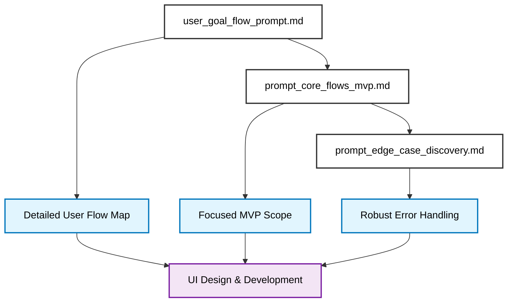

# Design Directory Overview

This directory contains the canonical prompts and processes for user experience design, flow mapping, and MVP scoping. These prompts are designed to be used sequentially during the early stages of product design to ensure robust, user-centered experiences before any visual design or development begins.

---

## Design Workflow Overview

The design process follows a systematic three-phase approach, with each phase building upon the previous one:



**Design Phases:**
1. **Flow Mapping**: Understand the complete user journey and decision points
   - `user_goal_flow_prompt.md`
2. **MVP Scoping**: Identify the essential flows that deliver core value
   - `prompt_core_flows_mvp.md`
3. **Edge Case Discovery**: Uncover potential failure points and error scenarios
   - `prompt_edge_case_discovery.md`

---

## File Summaries & Usage

### user_goal_flow_prompt.md
**Purpose:** Comprehensive prompt for mapping end-to-end user flows before any visual design begins. Includes mandatory ideation and context discovery to prevent the common pitfall of designing polished UI components without understanding the underlying user journey.
**Key Features:**
- **Ideation & Context Discovery**: 5 required questions for user context, competitive analysis, and success stories
- **Design Review Protocol**: Mandatory feedback system for poorly scoped or insufficient requests
- **6-step flow mapping protocol** with enhanced template
- **Error handling and edge case considerations**
- **Integration guidelines with design process**
**When to use:** Use first when starting any new product design or feature to understand the complete user journey before wireframing. The prompt will guide you through ideation and provide feedback if your request needs clarification.

### prompt_core_flows_mvp.md
**Purpose:** Strategic prompt for identifying the 2-3 essential flows that represent the minimum viable product. Prevents overbuilding features before validating core value proposition.
**Key Features:**
- 6-step core flow identification protocol
- Comprehensive MVP scoping template
- Clear exclusion criteria for non-essential features
- Integration with product development process
**When to use:** Use after flow mapping to focus on the essential user journeys that deliver core value and can be quickly tested.

### prompt_edge_case_discovery.md
**Purpose:** Systematic prompt for uncovering potential failure points and edge cases in user flows before they become production bugs. Ensures robust, resilient user experiences.
**Key Features:**
- 6-step edge case discovery protocol
- Two prompt templates (comprehensive and quick assessment)
- Five categories of edge cases (Data, User Behavior, System Failures, Environmental, Business Logic)
- Priority rating system for impact assessment
**When to use:** Use after identifying core flows to ensure all potential failure points are addressed before implementation.

---

## Example Design Flows

### Example 1: Team Meeting Scheduler App

#### Phase 1: Flow Mapping (user_goal_flow_prompt.md)
**Input:** "I want to build an app that helps teams schedule meetings efficiently"

**Design Review**: 
> "This request needs more context. What specific pain points do users have with current meeting scheduling? What makes your solution different? Let me ask some clarifying questions..."

**After Clarification**:
```
You are mapping the user flow for scheduling a team meeting efficiently.

**User Goal**: Schedule a team meeting with all required participants at an optimal time

**Context**: Team collaboration app with calendar integration

**Constraints**: Must work across different time zones, handle availability conflicts

**User Context & Motivation**: Team managers spend 30+ minutes manually coordinating schedules, dealing with back-and-forth emails, and managing timezone confusion

**Interaction Context**: Users typically schedule meetings from desktop during work hours, often under time pressure before deadlines

**Retention Factors**: Users return when the app saves them significant time and reduces scheduling friction; blockers include poor timezone handling and limited calendar integration

**Competitive Landscape**: 
- Calendly: Good for 1:1s, poor for team coordination
- Doodle: Simple but lacks calendar integration
- When2meet: Free but no professional features

**Success Story**: Sarah, a product manager, used to spend 45 minutes coordinating a 15-person team meeting across 3 timezones. With this app, she scheduled the same meeting in 3 minutes and everyone received calendar invites automatically.

Map the complete end-to-end user journey including:
[Follow the 6-step protocol]
```

**Successful Result:** A comprehensive flow map showing:
- Entry points (dashboard, calendar view, team page)
- Core actions (select participants, choose time slots, set meeting details)
- Decision points (conflict resolution, time zone handling, meeting type selection)
- Success paths (confirmation, calendar integration, notifications)
- Error scenarios (no available times, participant conflicts, API failures)
- Exit points (meeting created, meeting cancelled, flow abandoned)

#### Phase 2: MVP Scoping (prompt_core_flows_mvp.md)
**Input:** The comprehensive flow map from Phase 1

**Prompt Application:**
```
You are identifying the core MVP flows for a team meeting scheduler.

**Product Vision**: Help teams schedule meetings efficiently by automating participant coordination and time slot selection

**Target User**: Team managers and assistants who regularly schedule meetings with multiple participants

**Success Criteria**: Users can successfully schedule meetings with all participants and receive confirmation

Identify the 2-3 essential flows that represent the minimum viable product:
[Follow the detailed specification format]
```

**Successful Result:** Focused MVP scope with:
- **Core Value Flow**: Meeting creation with participant selection and time slot choosing
- **User Onboarding**: First-time setup and team member invitation
- **Value Reinforcement**: Viewing scheduled meetings and receiving confirmations

#### Phase 3: Edge Case Discovery (prompt_edge_case_discovery.md)
**Input:** The focused MVP scope from Phase 2

**Prompt Application:**
```
You are analyzing potential edge cases for the user flow: Team meeting scheduling with calendar integration.

**Flow Overview**: User selects participants, chooses time slots, and creates calendar events

**Key Dependencies**: User permissions, calendar API, participant availability, network connectivity

**Target Users**: Team managers and assistants with varying technical skills

[Follow the comprehensive edge case analysis protocol]
```

**Successful Result:** Comprehensive edge case analysis including:
- **High Priority**: Missing participant permissions, calendar API failures, network connectivity issues
- **Medium Priority**: Invalid time slot selections, conflicting meeting schedules, time zone conversion errors
- **Low Priority**: UI responsiveness issues, browser compatibility problems

**Error Handling Strategy:** Clear recovery paths for each edge case with user-friendly messaging and alternative actions.

---

### Example 2: Personal Finance Tracking App

#### Phase 1: Flow Mapping (user_goal_flow_prompt.md)
**Input:** "I want to build an app that helps people track their personal finances and understand their spending patterns"

**Design Review**:
> "This is a good start, but let's clarify the user context. What specific financial challenges do people face? How do current solutions fall short? What would make someone choose your app over existing options?"

**After Clarification**:
```
You are mapping the user flow for personal finance tracking and spending analysis.

**User Goal**: Track daily expenses and understand spending patterns to improve financial health

**Context**: Mobile-first personal finance app with bank integration

**Constraints**: Must handle multiple accounts, categorize transactions, and provide privacy protection

**User Context & Motivation**: People struggle with overspending, lack visibility into spending patterns, and find existing apps too complex or not privacy-focused

**Interaction Context**: Users typically track expenses on mobile during or after purchases, often in short sessions throughout the day

**Retention Factors**: Users return when they see clear spending insights and progress toward financial goals; blockers include data entry friction and unclear value

**Competitive Landscape**:
- Mint: Comprehensive but complex, privacy concerns
- YNAB: Good budgeting but steep learning curve
- Personal Capital: Investment-focused, not daily spending

**Success Story**: Alex, a recent graduate, was spending $200/month on coffee without realizing it. After using this app for 2 weeks, they identified the pattern, set a $50/month coffee budget, and saved $150/month while still enjoying their daily coffee.

Map the complete end-to-end user journey including:
[Follow the 6-step protocol]
```

**Successful Result:** A comprehensive flow map showing:
- Entry points (dashboard, transaction entry, bank sync)
- Core actions (add transactions, categorize spending, view reports)
- Decision points (category selection, account choice, date ranges)
- Success paths (insights generated, goals tracked, spending reduced)
- Error scenarios (bank sync failures, categorization errors, data corruption)
- Exit points (insights viewed, goals updated, app closed)

#### Phase 2: MVP Scoping (prompt_core_flows_mvp.md)
**Input:** The comprehensive flow map from Phase 1

**Prompt Application:**
```
You are identifying the core MVP flows for a personal finance tracking app.

**Product Vision**: Help users track daily expenses and understand spending patterns to improve financial health

**Target User**: Individuals who want to gain better control over their personal finances

**Success Criteria**: Users can track expenses, categorize spending, and view basic insights about their financial patterns

Identify the 2-3 essential flows that represent the minimum viable product:
[Follow the detailed specification format]
```

**Successful Result:** Focused MVP scope with:
- **Core Value Flow**: Daily expense tracking with manual entry and categorization
- **User Onboarding**: Account setup and initial spending categories
- **Value Reinforcement**: Basic spending insights and pattern recognition

#### Phase 3: Edge Case Discovery (prompt_edge_case_discovery.md)
**Input:** The focused MVP scope from Phase 2

**Prompt Application:**
```
You are analyzing potential edge cases for the user flow: Personal finance tracking with manual entry.

**Flow Overview**: User manually enters expenses, categorizes them, and views spending insights

**Key Dependencies**: Local data storage, categorization system, calculation engine

**Target Users**: Individuals with varying financial literacy and technical skills

[Follow the comprehensive edge case analysis protocol]
```

**Successful Result:** Comprehensive edge case analysis including:
- **High Priority**: Data loss scenarios, calculation errors, invalid transaction amounts
- **Medium Priority**: Categorization conflicts, duplicate entries, date format issues
- **Low Priority**: UI responsiveness, offline functionality, data export issues

**Error Handling Strategy:** Robust data validation, clear error messages, and data recovery mechanisms.

---

## Integration with Project Management

This design directory integrates with the project management workflow:

### Connection Points
- **After Brainstorming**: Use these prompts to structure and validate design concepts
- **Before Specification**: Use flow mapping to inform technical requirements
- **During Project Setup**: Use MVP scoping to define project boundaries
- **Before Ticket Creation**: Use edge case discovery to inform implementation requirements

### Workflow Integration
1. **Start with** `user_goal_flow_prompt.md` to understand the complete user journey (includes ideation and review)
2. **Use** `prompt_core_flows_mvp.md` to focus on essential value delivery
3. **Apply** `prompt_edge_case_discovery.md` to ensure robust implementation
4. **Proceed to** project specification and Linear project creation
5. **Reference** design outputs when creating implementation tickets

---

## Quick Start Recommendations

### For New Product Ideas
1. **Start with:** `user_goal_flow_prompt.md` to map the complete user journey (expect feedback and clarification requests)
2. **Then scope:** `prompt_core_flows_mvp.md` to identify essential flows
3. **Finally validate:** `prompt_edge_case_discovery.md` to ensure robustness
4. **Proceed to:** Project specification and development planning

### For Feature Additions
- **New user flows?** Use `user_goal_flow_prompt.md` to understand the complete journey
- **Scope validation?** Use `prompt_core_flows_mvp.md` to ensure focus on core value
- **Implementation planning?** Use `prompt_edge_case_discovery.md` to identify potential issues

### For Design Reviews
- **Flow completeness?** Review outputs from `user_goal_flow_prompt.md`
- **MVP alignment?** Validate against `prompt_core_flows_mvp.md` scope
- **Error handling?** Check coverage from `prompt_edge_case_discovery.md`

---

## Success Metrics

A successful design process should deliver:
- **Clear user journey maps** that guide UI design and development
- **Focused MVP scope** that can be quickly implemented and tested
- **Comprehensive error handling** that prevents user frustration
- **Actionable design artifacts** that inform project specification and ticket creation
- **Validated user context** through comprehensive ideation and competitive analysis
- **Improved design thinking** through mandatory review and feedback processes

Remember: **Flow first, polish later**. These prompts ensure you understand the user journey and potential failure points before investing in visual design or development. 