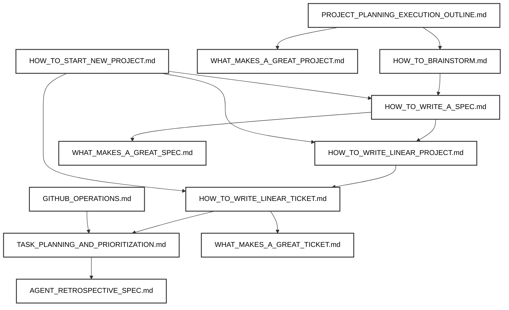

# Project Management Directory Overview

This directory contains the canonical guides and processes for planning, executing, and managing projects from initial ideation through delivery. Use this README to understand the project lifecycle and locate the right guide for each phase of your project.

---

## Project Workflow Overview

The project management process follows a systematic five-phase approach, with each phase building upon the previous one:

**Workflow Phases:**
1. **Planning & Brainstorming**: Start with the outline, then conduct brainstorming
   - `PROJECT_PLANNING_EXECUTION_OUTLINE.md`
   - `HOW_TO_BRAINSTORM.md`
2. **Specification**: Create comprehensive project specifications
   - `HOW_TO_WRITE_A_SPEC.md`
   - `WHAT_MAKES_A_GREAT_SPEC.md`
3. **Project Setup**: Establish Linear projects and organizational structure
   - `HOW_TO_WRITE_LINEAR_PROJECT.md`
   - `HOW_TO_START_NEW_PROJECT.md`
   - `WHAT_MAKES_A_GREAT_PROJECT.md`
4. **Ticket Creation**: Break down work into actionable tickets
   - `HOW_TO_WRITE_LINEAR_TICKET.md`
   - `WHAT_MAKES_A_GREAT_TICKET.md`
5. **Execution**: Plan, prioritize, and execute tasks
   - `TASK_PLANNING_AND_PRIORITIZATION.md`
   - `GITHUB_OPERATIONS.md`
6. **Retrospective**: Capture learnings and improve workflows
   - `AGENT_RETROSPECTIVE_SPEC.md`

---

## File Summaries & Usage

### PROJECT_PLANNING_EXECUTION_OUTLINE.md
**Purpose:** The master guide that outlines the complete five-phase approach to project planning and execution, from initial brainstorming through delivery and continuous improvement.
**References:** All other project management files are referenced throughout the phases.
**When to use:** Start here for any new project to understand the complete workflow and how all components fit together.

### HOW_TO_BRAINSTORM.md
**Purpose:** Comprehensive guide for AI agents to conduct effective brainstorming sessions, including conversation phases, question frameworks, and brain dump file creation.
**References:** Feeds into HOW_TO_WRITE_A_SPEC.md and PROJECT_PLANNING_EXECUTION_OUTLINE.md.
**When to use:** Use when starting a new project to gather comprehensive context and requirements through collaborative exploration.

### HOW_TO_WRITE_A_SPEC.md
**Purpose:** Structured approach to creating well-scoped, cross-functionally-aligned specifications through five stakeholder-aligned phases.
**References:** Feeds into HOW_TO_WRITE_LINEAR_PROJECT.md and HOW_TO_WRITE_LINEAR_TICKET.md.
**When to use:** Use after brainstorming to create a comprehensive project specification ready for Linear project creation.

### HOW_TO_WRITE_LINEAR_PROJECT.md
**Purpose:** Canonical style guide for creating Linear projects with clear structure, problem statements, objectives, scope, timeline, and risk mitigation.
**References:** Uses output from HOW_TO_WRITE_A_SPEC.md and feeds into HOW_TO_WRITE_LINEAR_TICKET.md.
**When to use:** Use when creating a new Linear project from an approved specification.

### HOW_TO_WRITE_LINEAR_TICKET.md
**Purpose:** Definitive guide for writing implementation-ready Linear tickets with clear requirements, test plans, dependencies, and acceptance criteria.
**References:** Uses output from HOW_TO_WRITE_A_SPEC.md and feeds into TASK_PLANNING_AND_PRIORITIZATION.md.
**When to use:** Use for every ticket you create to ensure they are actionable, testable, and complete.

### HOW_TO_START_NEW_PROJECT.md
**Purpose:** Step-by-step guide that orchestrates the entire project setup process, from spec creation through Linear project and ticket generation.
**References:** Integrates HOW_TO_WRITE_A_SPEC.md, HOW_TO_WRITE_LINEAR_PROJECT.md, and HOW_TO_WRITE_LINEAR_TICKET.md.
**When to use:** Use as a comprehensive checklist when starting any new project to ensure all steps are completed.

### TASK_PLANNING_AND_PRIORITIZATION.md
**Purpose:** Comprehensive rules for decomposing, prioritizing, and tracking tasks with Linear/GitHub integration, dependency management, and progress tracking.
**References:** Integrates with GITHUB_OPERATIONS.md and other execution-related files.
**When to use:** Use for planning, breaking down, and prioritizing work during project execution.

### GITHUB_OPERATIONS.md
**Purpose:** Canonical guide for all GitHub operations including branching, PRs, commits, and Linear integration for project tracking.
**References:** Supports TASK_PLANNING_AND_PRIORITIZATION.md and project execution workflows.
**When to use:** Use for any GitHub-related workflow, especially when linking PRs to Linear tickets.

### WHAT_MAKES_A_GREAT_PROJECT.md
**Purpose:** Quality criteria for Linear projects from the perspective of engineers, PMs, and staff engineers, including technical and business considerations.
**References:** Complements HOW_TO_WRITE_LINEAR_PROJECT.md and PROJECT_PLANNING_EXECUTION_OUTLINE.md.
**When to use:** Use to review or improve Linear projects before launch.

### WHAT_MAKES_A_GREAT_SPEC.md
**Purpose:** Evaluation criteria for specifications from multiple stakeholder perspectives, ensuring cross-functional alignment and completeness.
**References:** Complements HOW_TO_WRITE_A_SPEC.md and PROJECT_PLANNING_EXECUTION_OUTLINE.md.
**When to use:** Use to review or improve specifications before project kickoff.

### WHAT_MAKES_A_GREAT_TICKET.md
**Purpose:** Quality standards for Linear tickets, ensuring they are actionable, testable, and provide clear value to stakeholders.
**References:** Complements HOW_TO_WRITE_LINEAR_TICKET.md and PROJECT_PLANNING_EXECUTION_OUTLINE.md.
**When to use:** Use to review or improve tickets before assignment or implementation.

### AGENT_RETROSPECTIVE_SPEC.md
**Purpose:** Structured system for capturing learnings and insights after each ticket completion through a three-phase process (agent self-assessment → user input → synthesis).
**References:** Integrates with HOW_TO_EXECUTE_A_TICKET.md and PROJECT_PLANNING_EXECUTION_OUTLINE.md.
**When to use:** Use after every ticket completion to systematically capture learnings and improve future workflows.

---

## Quick Start Recommendations

### For Brand New Projects
1. **Start with:** `PROJECT_PLANNING_EXECUTION_OUTLINE.md` to understand the complete workflow
2. **Then conduct:** `HOW_TO_BRAINSTORM.md` session to gather context and requirements
3. **Create specification:** Use `HOW_TO_WRITE_A_SPEC.md` with `WHAT_MAKES_A_GREAT_SPEC.md` for review
4. **Set up project:** Follow `HOW_TO_START_NEW_PROJECT.md` for complete setup
5. **Plan execution:** Use `TASK_PLANNING_AND_PRIORITIZATION.md` for ongoing work

### For Existing Projects
- **Writing tickets?** Use `HOW_TO_WRITE_LINEAR_TICKET.md` and review with `WHAT_MAKES_A_GREAT_TICKET.md`
- **Creating new Linear projects?** See `HOW_TO_WRITE_LINEAR_PROJECT.md` and `WHAT_MAKES_A_GREAT_PROJECT.md`
- **Planning or prioritizing work?** Reference `TASK_PLANNING_AND_PRIORITIZATION.md`
- **Managing GitHub/PRs?** Use `GITHUB_OPERATIONS.md`
- **Completing tickets?** Use `AGENT_RETROSPECTIVE_SPEC.md` to capture learnings and insights

### For Project Reviews
- **Reviewing specs:** Use `WHAT_MAKES_A_GREAT_SPEC.md`
- **Reviewing projects:** Use `WHAT_MAKES_A_GREAT_PROJECT.md`
- **Reviewing tickets:** Use `WHAT_MAKES_A_GREAT_TICKET.md`

---

## Integration with Other Directories

This project management directory integrates with other task instruction directories:

- **Rules Directory:** References coding rules, UI rules, and conversation style guidelines
- **Engineering Directory:** Connects to technical implementation and architecture guidelines
- **Design Directory:** Links to UX/UI design processes and standards

For any project management task, always check cross-references in the relevant file descriptions above to ensure you are following all required standards and dependencies. 